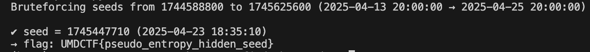

## Challenge

## Description

## Additional files

1. `secret.py` - The file e
2. `secret.bin`

## Source Code Analysis 

The script seeds Python’s Mersenne Twister with the current UNIX timestamp (int(time.time())), then generates a byte‐wise keystream via random.getrandbits(8) and XORs it against the fixed‐format flag b"UMDCTF{…}". The resulting ciphertext is written to secrets.bin.

### Possible weakness

1. Predictable Seed: Because time.time() changes only once per second, we only need to try a few hundred candidate seeds around the file’s creation time.
2. Known Plaintext: Since the flag is in formt of UMDCTF{flag}.
3. Easy XOR Recovery: For each guessed seed, regenerating the keystream and XOR’ing with the ciphertext yields the flag in plain ASCII.

## Exploit

 **Brute-Force the Seed**  
For each second in that range:  
- Reseed Python’s PRNG with that integer timestamp.  
- Generate a keystream of equal length via `random.getrandbits(8)`.  
- XOR each ciphertext byte with the corresponding keystream byte to produce candidate plaintext.

Based on the information create a python exploit code in `exploit.py`

The exploit was successful in recovering the flag based on the timestamp after we initially generated a local file with the known string. Then we ran it on the file we got from the challenge. 

After a while, it worked when we attempted a time range depending on the CTF start time. 

## Flag

### Solved By - aroha