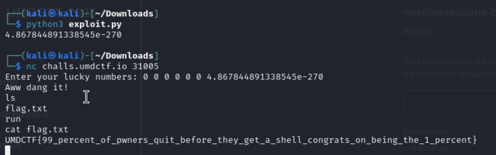

# Gambling2

## Category
`Pwn`

## Description
i gambled all of my life savings in this program (i have no life savings).

### Additonal files
1. `Dockerfile` - docker file to run the code
2. `gambling` - object file
3. `gambling.c` - C source code
4. `Makefile` - makefile 

## Solution

- The `gamble()` function reads 7 floats into a 4-element array (`float f[4]`), causing a **stack overflow**.
- Goal: Redirect execution to `print_money()`, which spawns a shell.
- Found `print_money()` address via GDB:

- Used Python to encode the address into a float:

```python
import struct
packed = b'JUNK' + struct.pack('<I', 0x080492c0)
print(struct.unpack('<d', packed)[0]) 
```

Running the above script and adding the output with a bunch of 0 in front we get the below output. 


Flag `UMDCTF{99_percent_of_pwners_quit_before_they_get_a_shell_congrats_on_being_the_1_percent}`

### Solved by - aroha
