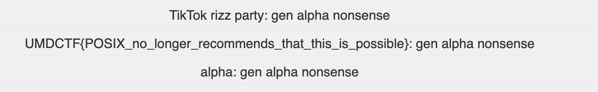

# Brainrot-dictionary

## Challenge

The challnege was a web app with a file upload option and two buttons. One to Submit the file and one to view the the list of words. WE

Description : 
This website will help you understand the rest of the nonsense going on in the CTF. You can even upload your own brainrot words and get definitions!


## Additional Files
- `main.py` Show the server code and how it handles the uploaded code. 
- `requirements.txt` requirements to build the app. 

## Source Code Analysis

1. **Upload Handling**  
   - The `index()` route only checks that the uploaded filename ends with `.brainrot`.  
   - It then does:
     ```python
     fname = unquote(user_file.filename)
     user_file.save(os.path.join(session['upload_dir'], fname))
     ```
   - **No** `secure_filename()` sanitization is applied, so spaces and other shell-sensitive characters remain intact.

2. **Directory Setup**  
   - On first upload (or if the session’s directory is missing), `create_uploads_dir()` runs:
     ```python
     dirname = os.path.join(UPLOAD_FOLDER, ''.join(random.choices(string.ascii_letters, k=30)))
     session['upload_dir'] = dirname
     os.mkdir(dirname)
     os.popen(f'cp flag.txt {dirname}')
     os.popen(f'cp basedict.brainrot {dirname}')
     ```
   - This copies both `flag.txt` and `basedict.brainrot` into the new directory.

3. **File Listing**  
   - The `/dict` route executes:
     ```bash
     find <upload_dir> -name \*.brainrot | xargs sort | uniq
     ```
   - The intent is to list only `.brainrot` files under the upload directory.  
   - **But** `xargs` splits on **any** whitespace which can be exploited!!.

4. **Exploit**  
   - By uploading a file named:
     ```
     flag.txt basedict.brainrot
     ```
   - `find` will output:
     ```
     uploads/<rand>/flag.txt basedict.brainrot
     ```
   - When piped to `xargs sort`, it is split into two tokens:
     ```
     uploads/<rand>/flag.txt
     basedict.brainrot
     ```
   - After `sort | uniq`, `uploads/<rand>/flag.txt` appears in the web UI listing, leaking the flag file’s path.

---

## Solution

1. Create a file with the exact name: flag.txt basedict.brainrot
2. Upload it via the web interface.
3. When we check the `/dict` page to see `uploads/<rand>/flag.txt` listed. We have the contents of the file listed, i.e the flag. 

### The Flag



### Solved by - aroha