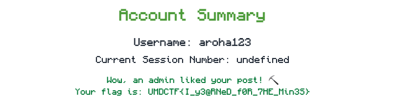

# A Minecraft Movie

## Challenge
A web app lets me register, create posts, like/dislike, and submit a `postId` for an admin bot to view.

## Reconnaissance
1. I registered and logged in.  
2. I created posts (title + content).  
3. I can like or disliked posts (the dislikes go into negative as well).  
4. Admin bot visits any post when I supply its `postId`. It by defaulkt dislikes all post that i submit.

## Login Testing
I tried basic SQL injection on the login form (e.g. `admin' --`)—no success.

## Post Creation Testing
I focused on **XSS** payloads in title and content to inject scripts, but all `<script>` and event handlers were filtered.

## Post ID
Each post is retrieved by a random UUID (`6a75eeed-2128-47f2-a552-a9dca81ebd81`), so guessing wasn't feasible.

## Admin Interaction
On the admin page there was a form where I paste my `postId` and the admin bot will like/dislike that post.

### Input Filtering & Polyglot Testing

- All `<script>` tags and `on*` attributes (e.g. `onload`, `onclick`) are removed.  
- `javascript:` URIs and embed tags (`<iframe>`, `<svg>`) are sanitized.  
- Even mixed-case/malformed polyglots like below failed:
  ```html
  jaVasCript:/*…*/onerror=alert(1)<svg onload=alert(1)>

## Exploitation
1. **XSS attempts** failed due to strict sanitization of the request.  
2. The prompt “Think you can get an admin to like your post?” hinted at tricking the admin into visiting our post (CSRF).  
3. Post content accepts raw `<form>` tags—our payload is stored server-side without sanitization.  
4. I embedded an invisible, auto-submitting form that sends a “like” when the admin loads our post:

   ```html
   <form action="https://a-minecraft-movie-api.challs.umdctf.io/legacy-social" method="POST">
     <input name="sessionNumber" value="23">
     <input name="postId"        value="e7181b50-1d30-4c07-ba37-4350383322e3">
     <input name="likes"        value="1">
     <input type="submit" autofocus
            style="position:fixed;top:0;left:0;width:100%;height:100%;opacity:0">
   </form>


### The Flag



### Solved by - aroha