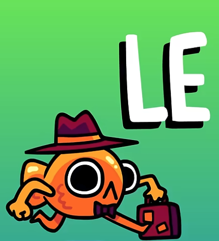

# Steve Le Poisson 



## Overview
- Everything (code, comments, messages) was in French.  
- API: `GET /deviner` at `steve-le-poisson-api.challs.umdctf.io`  
- Requires header `X-Steve-Supposition` matching `/^[A-Za-z0-9{}]+$/`.
- Server code was provied.

## Additional Files
- `index.js` shows French middleware monologues like “Pourquoi tant de formalisme ? … algues synthétiques…”  
- Comments and endpoint names in the repo are consistently French which i transalted, which helped map messages to logic.

## Reconnaissance
1. Loaded the SPA and watched DevTools → saw `X-Steve-Supposition: test`.  
2. Page plays a video and displays lyrics to a French song.  
3. Middleware checks:
   - Header names ≤ 80 chars, values ≤ 80 chars, no null bytes, ≤ 30 total headers  
   - `X-Steve-Supposition` only alphanumerics and `{}`

## Vulnerability
- Header value is directly concatenated into SQL:
  ```sql
  SELECT * FROM flag WHERE value = '<X-Steve-Supposition>';
  ```
- Express merges duplicate headers into a comma-separated string **after** validation — a classic case of header‑smuggling.

## Exploit (Boolean Oracle)
1. Send two headers:
   ```http
   X-Steve-Supposition: ' OR '1'='1'--
   X-Steve-Supposition: SAFE123
   ```
2. The server warns: “Every request you send is like a novel... And what’s with all these duplicate headers?” — hinting at multiple header parsing.  
3. Merged into `"' OR '1'='1'--, SAFE123"`, passing the regex on the second part.  
4. SQL becomes:
   ```sql
   SELECT * FROM flag WHERE value = '' OR '1'='1'--, SAFE123';
   ```
5. Returns “Tu as raison!” on success.

## Flag Extraction
- Automated blind SQLi with binary search:
  - **Length**: test `length(value) > M` → ~7 queries  
  - **Chars**: test `substr(value,pos,1) > 'X'` over ordered alphabet → ~6 queries/char  
- Flag:
  ```text
  UMDCTF{ile5TVR4IM3NtTresbEAu}
  ```

## Mitigations
- Reject or canonicalize duplicate headers before validation.  
- Use parameterized queries or an ORM for calling the database.  
- Normalize headers and enforce validation on the final merged value.

## Lessons Learned
- Middleware quirks (duplicate-header merging) can bypass filters.  
- Blind SQL injection remains practical with boolean oracles.

## Personal Note
I’m not fluent in French, but the video was anyoying at first  but “Steve the Fish” quickly grew on me  — I started to like it after listening to it so many times!. Here is the link - https://www.youtube.com/shorts/5dItHeeHKBw

### Solved byy - aroha